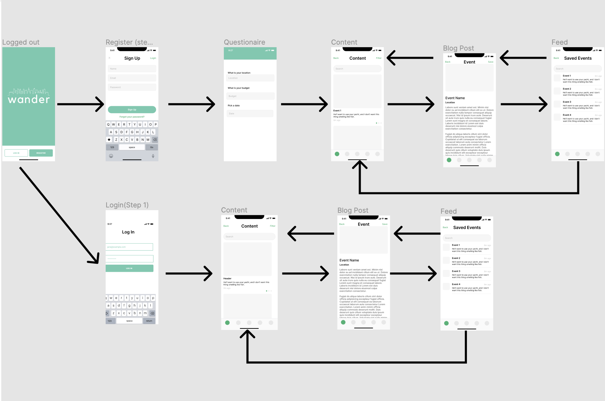

# Wander iOS App

## Table of Contents
1. [Overview](#Overview)
1. [Product Spec](#Product-Spec)
1. [Wireframes](#Wireframes)
2. [Schema](#Schema)

## Overview
### Description
Planning dates or activities can be hard, especially when you're on a budget, or even worse... when you're in the middle of a pandemic! That's why we created an app that does it all for you! Wander creates an itinerary of activities around you based on your preferences and budget. Upon signing up, you are prompted to take a short quiz for a more personalized result.

### App Evaluation

- **Category:** Lifestyle
- **Mobile:** Yes
- **Story:** The idea came across as we are going through a pandemic and its is hard to plan activities that align with our interest and our pockets as well as it was unpredictable to know whether a place was open or not. 
- **Market:** Everyone who is adventurous 
- **Habit:** 
- **Scope:** Wander is an application that aims to help people plan their activities around their city based on their interest and budget. The main goal is to help people get out from their comfort zone and discover places and activities around them. 


## Product Spec

### 1. User Stories (Required and Optional)

**Required Must-have Stories**

* User can register for an account
* User can log in
* User can fill in/modify the interest form
* User can pick a date
* User can set a budget
* User location

**Optional Nice-to-have Stories**

* User can opt to avoid an activity 
* User can keep track their previous activities
* User can favorite places and activities
* User can create their own activities
* User can review the place/activity

### 2. Screen Archetypes

* Login/register Screen 
   * User can choose to login or register for a new account
* Register Screen
   * User can create a new account
   * User fills in basic information
   * User fills in form about interest and activities they prefer
* Home Profile Screen
    * User can read about activities around their area
* Map screen
    * User can see the activities/places in a map
    * User can choose the budget and get sorted activities
* Event screen
    * User can read about a specific activity
* Favorites
    * User's saved activities/places
* Settings
    * User can change settings

### 3. Navigation

**Tab Navigation** (Tab to Screen)

* Home
* Login
* Register
* Profile
* Activity
* Map

**Flow Navigation** (Screen to Screen)

* Home
   * Login
   * Register
* Login
   * Profile
* Register
    * Sigup page
    * Insterest form
    * Profile 
* Profile
    * Map
    * Settings
    * Activity
* Map
    * Activity
    * Profile
* Settings
    * Profile
* Activity
    * Map
    * Profile

## Wireframes




## Schema 
### Models
#### Post

   | Property      | Type     | Description |
   | ------------- | -------- | ------------|
   | objectId      | String   | unique id for the user post (default field) |
   | author        | Pointer to User| image authors feed |
   | image         | File     | image that shows displays event |
   | caption       | String   | image caption of the event |
   | eventDate     | DateTime | date closest to current date and time|
  
   
### Networking
#### List of network requests by screen
   - Register Screen
      - (Read/GET) Query logged in user to the questionaire screen
   - Questionaire Screen
      - (Update/PUT) Update the users preferences
   - Login Screen
      - (Read/GET) Query logged in user to home feed
   - Home Feed Screen
      - (Read/GET) Fetch posts based on users preferences for the user's feed
         ```swift
         let query = PFQuery(className:"Post")
         query.whereKey("author", equalTo: currentUser)
         query.order(byDescending: "eventDate")
         query.findObjectsInBackground { (posts: [PFObject]?, error: Error?) in
            if let error = error { 
               print(error.localizedDescription)
            } else if let posts = posts {
               print("Successfully retrieved \(posts.count) posts.")
           // TODO: Do something with posts...
            }
         }
         ```
   - Content Screen
      - (Read/GET) Fetch a specific post for a user's feed
   - Saved Content Screen
      - (Read/GET) Fetch a history of saved posts for a user's feed
